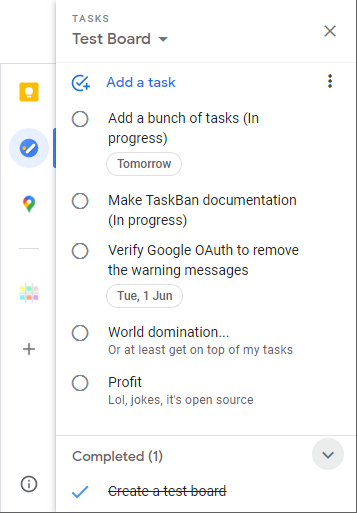
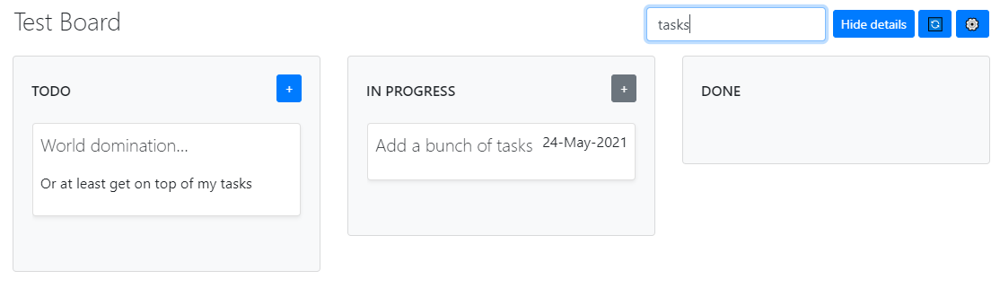
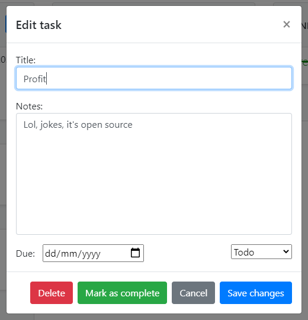
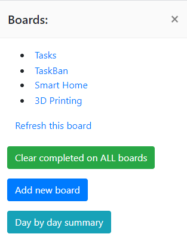
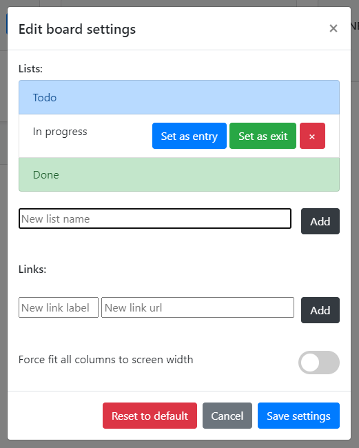

# Home
A kanban-style view of your Google Tasks. Each "list" in Google Tasks is shown as a "board" in TaskBan.

For example, if your Google Tasks list looks like this:

It will be shown on a TaskBan board like this:

You can type into the filter box in the top right corner to only show tasks containing specific text.

Or click on a task to open an edit dialog.

To change between different boards, click the heading in the top left corner to show the sidebar menu.

You can customise the columns for each board by clicking the gear icon in the top right corner.

Thats all there is to it! Happy task'ing.

# Add-on

A kanban-style view of your Google Tasks where each "task list" in Google Tasks is shown as a "kanban board" in TaskBan.

This [add-on](https://workspace.google.com/marketplace/app/taskban/674749721550) allows you to access TaskBan from gmail, calendar and google drive, in the add-on sidebar to the right. It doesn't relate in any way to the email/event/file you have open, but allows quick access links to each of your TaskBan boards. Clicking one of these links launches TaskBan in pop-up window for quick use. There is also a "Clear All Completed Tasks" button (in Calendar add-on only) to quickly clear all completed tasks in any list.

Of course TaskBan can also be accessed in a normal browser tab by going to https://taskban.davidlang.net, where you will be initially presented with a summary of tasks due today (or a different day, selectable by date picker or next/previous buttons). Clicking the heading shows the menu, where you can choose which board you would like to view.

When viewing a board, either in the pop-up window from the add-on or in a normal browser tab via https://taskban.davidlang.net?b=BOARD-NAME, each "task" in Google Tasks is shown as a "card" on the kanban board. These cards can be dragged between columns, initially set to "Todo", "In Progress", and "Done" but which can be customised in the settings for each board individually. Settings are found in the top right corner by clicking the gear icon.

You can modify a task by clicking the card to launch an edit dialog. Here you can set the due date, change its current column (if you don't like to drag them) as well as rename the task, or long notes text. All changes are saved directly to Google Tasks, so you can immediately go back to viewing your tasks as a list in Google Tasks, or on your Google Calendar, and they will never be out of sync.

Happy task'ing.

## Fine print

The tasks are only stored in Google Tasks, no duplication/syncing takes place. Because of this it is a single user experience.
There is a small amount of metadata stored in the Google Apps Script Properties Service, but this is also per user.
* Read more on the [privacy](privacy.md) and [terms of service](terms.md) pages.

To start using TaskBan, click here: [https://taskban.davidlang.net](https://taskban.davidlang.net)

If you like TaskBan, feel free to [buy me a coffee](https://ko-fi.com/davidlang42).

As TaskBan is open-source, you can find the full source code at: [https://github.com/davidlang42/taskban](https://github.com/davidlang42/taskban)
