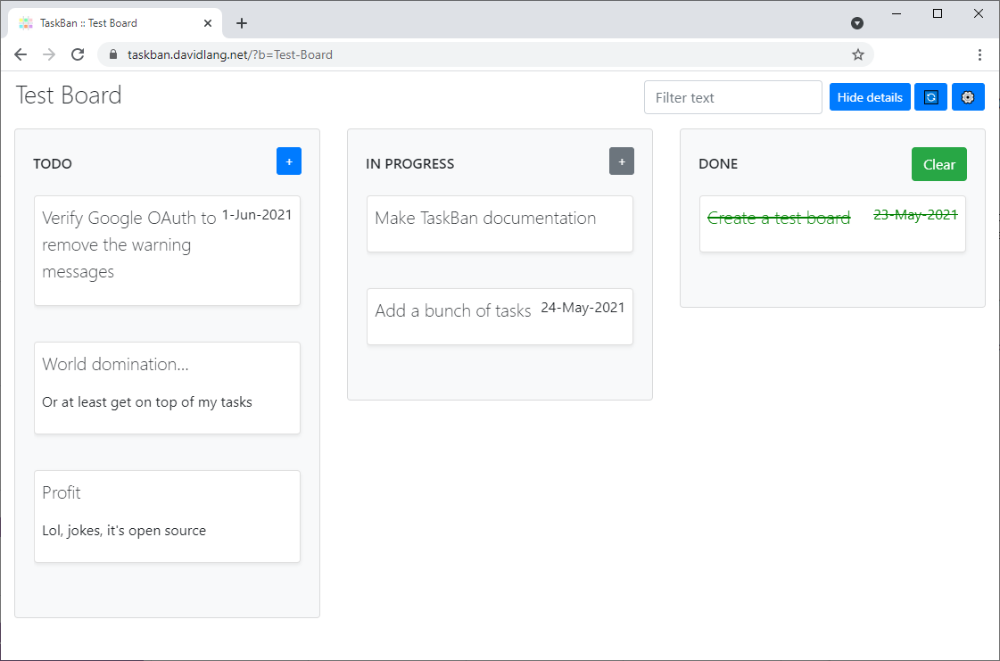

# Home
A kanban-style view of your Google Tasks. Each "list" in Google Tasks is shown as a "board" in TaskBan.

For example, if your Google Tasks list looks like this:

It will be shown on a TaskBan board like this:

You can type into the filter box in the top right corner to only show tasks containing specific text.

Or click on a task to open an edit dialog.

To change between different boards, click the heading in the top left corner to show the sidebar menu.

You can customise the columns for each board by clicking the gear icon in the top right corner.

Thats all there is to it! Happy task'ing.

## Fine print

The tasks are only stored in Google Tasks, no duplication/syncing takes place. Because of this it is a single user experience.
There is a small amount of metadata stored in the Google Apps Script Properties Service, but this is also per user.
* Read more on the [privacy](privacy.md) and [terms of service](terms.md) pages.

To start using TaskBan, click here: [https://taskban.davidlang.net](https://taskban.davidlang.net)

If you like TaskBan, feel free to [buy me a coffee](https://ko-fi.com/davidlang42).

As TaskBan is open-source, you can find the full source code at: [https://github.com/davidlang42/taskban](https://github.com/davidlang42/taskban)
